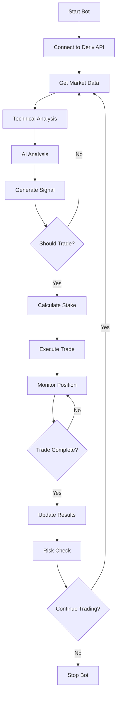

# 🤖 Deriv AI Trading Bot - Advanced Features & Architecture

## 🏗️ Project Architecture

```
trd_bot/
├── 📄 main.py                 # Main bot orchestrator
├── 🔌 deriv_api.py           # Deriv WebSocket API client
├── 🧠 ai_analyzer.py         # OpenAI GPT analysis engine
├── 📊 technical_analysis.py  # Technical indicators & signals
├── 🎯 martingale_system.py   # Smart martingale with unpredictability
├── 🛡️ risk_manager.py        # Advanced risk management
├── 🗄️ database.py            # Database models & operations
├── 📈 dashboard.py           # Web dashboard (FastAPI)
├── 🛠️ utils.py               # Utility functions
├── ⚙️ config.py              # Configuration management
├── 📋 requirements.txt       # Python dependencies
├── 🚀 start_bot.bat/.sh      # Startup scripts
├── 🌐 start_dashboard.bat/.sh # Dashboard startup
├── 📂 templates/             # HTML templates
│   └── dashboard.html        # Web dashboard UI
└── 📂 logs/                  # Log files
```

## 🤖 Smart Martingale System Features

### Unpredictable Pattern Generation
- **Time-based variations**: Uses current time for randomness
- **Pattern memory**: Avoids predictable sequences
- **Session-based adjustments**: Adapts to current session performance
- **Multiple random factors**: Combines various unpredictability sources

### Advanced Risk Management
- **Progressive scaling**: Maintains stake for first 3 losses, then scales
- **Confidence adjustments**: AI confidence affects stake size
- **Volatility compensation**: Reduces stakes in high volatility
- **Balance protection**: Never risks more than account can handle

### Smart Multiplier Calculation
```python
Dynamic Multiplier = Base × Confidence × Volatility × Loss_Factor
```

## 🧠 AI Analysis Engine

### Multi-Layer Analysis
1. **Technical Indicator Processing**
2. **Market Context Understanding**
3. **Historical Performance Integration**
4. **Risk-Adjusted Predictions**
5. **Confidence Scoring**

### AI Prompt Engineering
- **Market phase identification**
- **Multi-timeframe analysis**
- **Volume and momentum assessment**
- **Support/resistance recognition**
- **Candlestick pattern analysis**

## 📊 Technical Analysis Suite

### Indicators Included
- **RSI**: Momentum oscillator (14-period)
- **MACD**: Trend-following momentum indicator
- **Bollinger Bands**: Volatility-based bands
- **Moving Averages**: Multiple periods (10, 20, 50, 100)
- **Support/Resistance**: Dynamic level detection
- **Volatility**: ATR and historical volatility
- **Volume**: OBV and volume analysis
- **Candlestick Patterns**: 20+ pattern recognition

### Signal Generation
```python
Final Signal = (AI_Signal × 0.6) + (Technical_Signal × 0.4)
```

## 🛡️ Risk Management System

### Multi-Level Protection
1. **Position Size Limits**: Max 5% per trade
2. **Daily Loss Limits**: Configurable daily stop
3. **Consecutive Loss Limits**: Auto-shutdown after threshold
4. **Balance Protection**: Minimum balance requirements
5. **Volatility Adjustments**: Dynamic sizing based on market conditions

### Portfolio Risk Metrics
- **Sharpe Ratio**: Risk-adjusted returns
- **Maximum Drawdown**: Peak-to-trough decline
- **Win Rate**: Success percentage
- **Profit Factor**: Gross profit / Gross loss
- **Risk Score**: Composite risk assessment

## 🌐 Web Dashboard Features

### Real-Time Monitoring
- **Live statistics**: Updated via WebSocket
- **Performance charts**: Interactive Chart.js graphs
- **Trade history**: Detailed transaction log
- **AI analysis display**: Current predictions and confidence
- **Risk metrics**: Current exposure and limits

### Responsive Design
- **Mobile-friendly**: Works on all devices
- **Modern UI**: Tailwind CSS styling
- **Real-time updates**: WebSocket integration
- **Interactive charts**: Performance visualization

## 🔄 Trading Flow



## 📈 Performance Optimization

### Efficiency Features
- **Async Operations**: Non-blocking API calls
- **Data Caching**: Reduces API requests
- **Connection Pooling**: Maintains WebSocket connections
- **Error Recovery**: Automatic reconnection and retry logic

### Memory Management
- **Data Buffer Limits**: Prevents memory leaks
- **Garbage Collection**: Regular cleanup of old data
- **Resource Monitoring**: Track system usage

## 🔧 Configuration Options

### Trading Parameters
```python
MARTINGALE_CONFIG = {
    'initial_stake': 1.0,
    'max_consecutive_losses': 3,
    'multiplier': 2.0,
    'max_stake': 50.0,
    'unpredictability_factor': 0.1
}
```

### AI Settings
```python
AI_CONFIG = {
    'model': 'gpt-3.5-turbo',
    'temperature': 0.3,
    'max_tokens': 1000,
    'confidence_threshold': 0.6
}
```

### Risk Management
```python
RISK_CONFIG = {
    'max_position_size': 5.0,
    'daily_loss_limit': 100.0,
    'max_open_positions': 3,
    'emergency_stop_loss': 200.0
}
```

## 🚨 Safety Features

### Emergency Stops
- **Panic Button**: Immediate position closure
- **Daily Limits**: Automatic shutdown
- **Connection Loss**: Safe handling of disconnections
- **Error Cascades**: Prevent system failures

### Data Validation
- **Market Data**: OHLC validation
- **API Responses**: Error checking
- **Configuration**: Parameter validation
- **Database Integrity**: Transaction safety

## 📊 Analytics & Reporting

### Performance Metrics
- **Real-time P&L**: Current session performance
- **Historical Analysis**: Long-term trend analysis
- **Risk Metrics**: Drawdown, volatility, correlation
- **AI Performance**: Prediction accuracy tracking

### Export Capabilities
- **CSV Export**: Trade history export
- **JSON API**: Programmatic data access
- **Log Files**: Detailed operation logs
- **Performance Reports**: Automated reporting

## 🔮 Advanced Features

### Machine Learning Integration
- **Pattern Recognition**: Historical pattern matching
- **Adaptive Learning**: Strategy refinement over time
- **Market Regime Detection**: Bull/bear market identification
- **Anomaly Detection**: Unusual market condition alerts

### API Integrations
- **Multiple Exchanges**: Extensible to other platforms
- **News Feeds**: Economic calendar integration
- **Social Sentiment**: Twitter/Reddit sentiment analysis
- **Market Data**: Multiple data source support

## 🛠️ Development & Customization

### Extensibility
- **Plugin Architecture**: Easy feature additions
- **Custom Indicators**: Add your own technical indicators
- **Strategy Modules**: Implement custom trading strategies
- **Alert Systems**: Email, SMS, webhook notifications

### Testing Framework
- **Backtesting**: Historical strategy testing
- **Paper Trading**: Risk-free strategy validation
- **A/B Testing**: Compare strategy variants
- **Performance Benchmarking**: Strategy comparison tools

This advanced Deriv trading bot combines cutting-edge AI analysis with sophisticated risk management and an unpredictable martingale system, all wrapped in a user-friendly interface with comprehensive monitoring and safety features.
